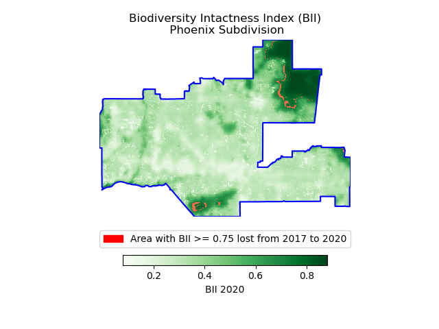

# phoenix-biodiversity-analysis
Biodiversity Intactness Index (BII) change in Phoenix, AZ

This repository explores the impacts of urban expansion in Phoenix, AZ on biodiversity. This will be accomplished by using the change in Biodiversity Intactness Index (BII) from 2017 to 2020.



### Repository structure

```bash
phoenix-biodiversity-analysis
│
└── data 
    │   tl_2020_04_cousub.shp  
│
│.gitignore
│README.md
│bii_phx.ipynb
│bii_phx_map.png
```

### Data

The BII data comes from the Microsoft Planetary Computer STAC catalog.
https://planetarycomputer.microsoft.com/dataset/io-biodiversity

The Phoenix Subdivision Shapefile comes from the US Census Bureau data.
https://catalog.data.gov/dataset/tiger-line-shapefile-2016-state-arizona-current-census-tract-state-based

### References

Microsoft. Biodiversity Intactness Index (BII). Microsoft Planetary Computer. Retrieved December 3, 2024, from https://planetarycomputer.microsoft.com/dataset/io-biodiversity

U.S. Census Bureau. (2016). TIGER/Line shapefile, 2016, state: Arizona, current census tract (state-based). U.S. Census Bureau. Retrieved December 3, 2024, from https://catalog.data.gov/dataset/tiger-line-shapefile-2016-state-arizona-current-census-tract-state-based

Z. Levitt and J. Eng, “Where America’s developed areas are growing: ‘Way off into the horizon’,” The Washington Post, Aug. 2021, Available: https://www.washingtonpost.com/nation/interactive/2021/land-development-urban-growth-maps/. [Accessed: Nov. 22, 2024]

F. Gassert, J. Mazzarello, and S. Hyde, “Global 100m Projections of Biodiversity Intactness for the years 2017-2020 [Technical Whitepaper].” Aug. 2022. Available: https://ai4edatasetspublicassets.blob.core.windows.net/assets/pdfs/io-biodiversity/Biodiversity_Intactness_whitepaper.pdf